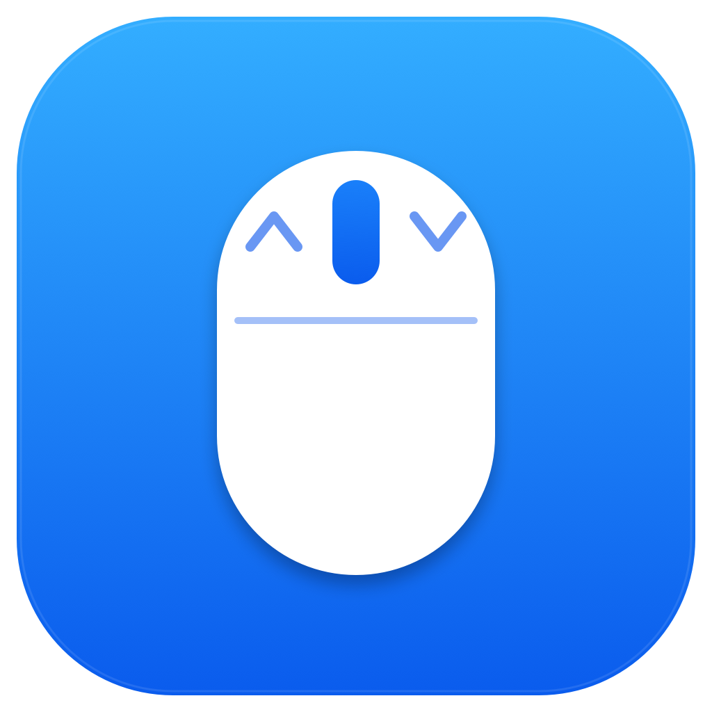
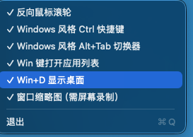

# MouseFix

<p align="center">
  
</p>

macOS 菜单栏小工具：让 Windows 用户无缝过渡。单文件 Swift 实现，无依赖，无沙箱。

A tiny macOS menu bar utility that makes Windows switchers feel at home. Single-file Swift, zero dependencies.

<p align="center">
  
</p>

## 功能

### 🖱 鼠标滚轮反转 + 惯性滚动
- 仅反转**鼠标**滚轮方向，触摸板不受影响（按 `scrollWheelEventIsContinuous` 区分）
- 模拟触摸板的动量滚动：速度指数衰减、亚像素累积、反向立即响应

### 🖱 鼠标中键：选中复制 / 无选中粘贴
- **有选中内容**时点中键 = 复制；**没有选中**时点中键 = 粘贴
- 兼容任意应用：中键按下先合成 `Cmd+C` 探测，剪贴板 ~250ms 内更新 = 原本有选中（复制完成），否则改发 `Cmd+V`
- **粘贴前经辅助功能 API 确认聚焦的是可编辑输入框**（文本框/文本域/组合框，或支持选区操作的自绘编辑器）；
  明确不是输入框则跳过粘贴，AX 无法判定时（终端等）仍保底粘贴
- 作用对象与系统快捷键一致：当前聚焦的应用；Finder 里有文件选中时中键同样复制文件
- 接管期间中键原生行为（浏览器中键打开链接、按住中键平移画布等）不再触发；不需要时可在菜单关闭

### 🪟 Alt+Tab 窗口切换器（Windows 风格）
- `Option+Tab` 呼出：**应用图标 + 统一尺寸窗口缩略图**，按最近使用排序，默认选中上一个窗口（快速点按即来回切换）
- `Tab` / `Shift+Tab` 移动选择，松开 `Option` 确认，`Esc` 或点击面板外取消
- **鼠标点击卡片直接切换**；悬停卡片浮现 **× 按钮**可关闭窗口（走应用自身的关闭流程，未保存内容会正常提示）
- 流畅体验：面板淡入；缩略图在**按下 Option 的瞬间预热截取**，出现时已完成加载；个别新窗口淡入补位
- 缩略图需「屏幕录制」权限；可在菜单切换**纯图标模式**，完全不捕捉屏幕

### 🗂 Win 键应用列表（类 Windows 开始菜单）
- **单独点按 Win 键**（PC 键盘映射为 Command）呼出 Dock 常驻应用网格，底部居中
- 输入即过滤，`Enter` 启动第一个匹配，点击图标直接启动，`Esc` 或点击面板外关闭
- 智能判定：`Cmd+C/V/Tab` 等组合键不会误触发

### 🖥 Win+D 显示桌面
- `Cmd+D` 隐藏全部应用窗口，再按一次恢复（只恢复由它隐藏的窗口）
- 可在菜单关闭，避免覆盖应用内的 `Cmd+D`（如浏览器收藏）

### ⌨️ Windows 风格 Ctrl 快捷键

| 按键 | 改写为 | 作用 |
|------|--------|------|
| `Ctrl+C` / `Ctrl+V` / `Ctrl+X` / `Ctrl+A` | `Cmd+C/V/X/A` | 复制 / 粘贴 / 剪切 / 全选 |
| `Ctrl+S` | `Cmd+S` | 保存 |
| `Ctrl+Z` | `Cmd+Z` | 撤销 |
| `Ctrl+Y` | `Cmd+Shift+Z` | 重做（macOS 标准，兼容性优于 `Cmd+Y`） |
| `Ctrl+Q` | `Ctrl+A` | 保留 macOS 原生的「移到行首」 |

- 其他修饰键原样保留（`Ctrl+Shift+V` 同样生效）
- **终端类 app 自动跳过**（Terminal、iTerm2、Warp、kitty、WezTerm、Alacritty、Hyper、Ghostty）——终端里 `Ctrl+C` 是 SIGINT、`Ctrl+Z` 是 SIGTSTP、`Ctrl+S` 是流控冻结，不能动

所有功能都可在菜单栏独立开关。

## 系统要求

- macOS 12 (Monterey) 及以上
- Apple Silicon（arm64）。Intel 机器需自行修改 `build.sh` 中的 `-target` 后重新编译

## 使用

1. 从 [Releases](../../releases) 下载 `MouseFix.app.zip`，解压后拖入「应用程序」文件夹（或任意位置）
2. 首次打开：右键 `MouseFix.app` → 打开（自签名证书，需绕过 Gatekeeper 提示）
3. 按提示授予**辅助功能**权限：系统设置 → 隐私与安全性 → 辅助功能 → 勾选 MouseFix
4. （可选）需要窗口缩略图时，按提示授予**屏幕录制**权限；只用纯图标模式可不给
5. 授权后自动生效，无需重启 app；菜单栏出现 `MouseFix`，点击可独立开关各项功能
6. 退出：菜单栏 → 退出

日志位于 `~/Library/Logs/MouseFix.log`，排查问题时可查看。

## 构建

```bash
./build.sh
open MouseFix.app
```

需要 Xcode Command Line Tools（`swiftc`）。
构建脚本会自动创建固定自签名证书「MouseFix Dev」（`make-identity.sh`，独立钥匙串 `.codesign/`，无弹窗），
因此辅助功能 / 屏幕录制授权**跨构建持续有效**，重新编译不用重新授权。

图标可用 `swift assets/make-icon.swift` 重新生成（`assets/icon-1024.png` → `assets/AppIcon.icns`）。

## 原理

单个 `CGEvent` tap（`.cgSessionEventTap` + `.headInsertEventTap`）同时拦截滚轮、键盘和修饰键事件：

- 滚轮：吞掉原始离散滚动，按帧注入带惯性的像素级合成事件（synthetic 事件打标防递归）
- 键盘：原地改写事件的修饰键 / 键码，不注入新事件，无递归风险
- 中键复制/粘贴：合成 `Cmd+C` 观察剪贴板 `changeCount` 判断是否有选中，无选中再补发 `Cmd+V`
- Alt+Tab 切换器：`CGWindowList` 按屏幕前后顺序枚举窗口（= 最近使用顺序），
  切换 / 关闭窗口通过辅助功能 API 按「标题 + 位置」双匹配定位，避免同名窗口认错
- Win 键检测：`flagsChanged` 里判定 Command「按下→松开全程无其他操作」才算单独点按

## License

MIT — 见 [LICENSE](LICENSE)。
